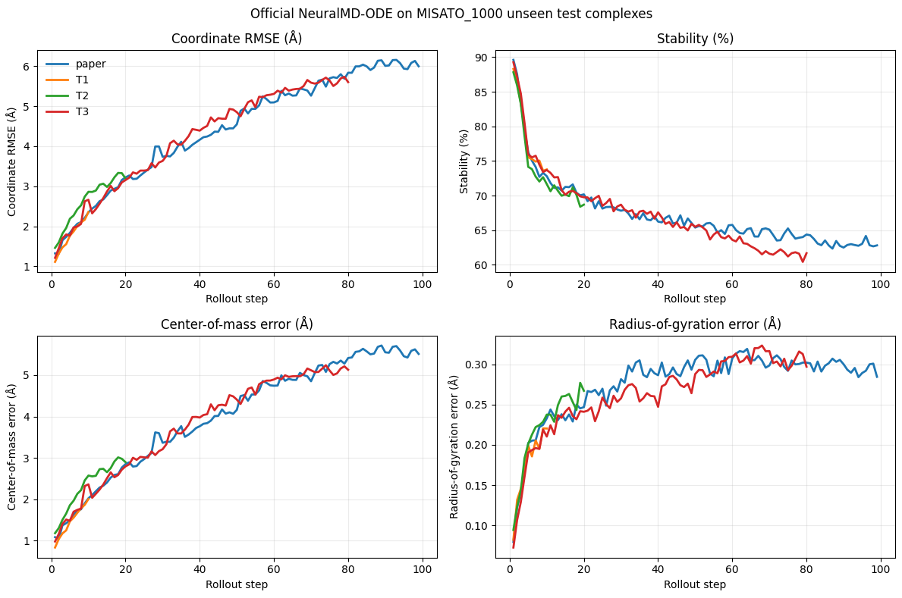

# GOAI Protein–Ligand Dynamics

GOAI「小分子–蛋白质结合轨迹预测」初赛实验。

当前主线是：**先复现官方 NeuralMD，再根据完整逐帧结果确定改进方向**。早期的 Static、Linear、Residual MLP 与键长投影实验仅保留为轻量诊断，不作为初赛主模型。

## 数据

- 全量 MISATO `MD.hdf5`：132.8 GB
- 主实验子集：NeuralMD 作者提供的 `MISATO_1000`，官方文件大小 7,455,614,516 bytes，800 / 100 / 100 complexes
- 早期诊断子集：`MISATO_100`，80 / 10 / 10 complexes
- 数据文件不上传 GitHub

`MISATO_100` 包含 80 / 10 / 10 个训练、验证和测试复合物。下载后运行：

```bash
python -m scripts.download_misato100
python -m scripts.inspect_misato --pdb-id 3SNC
```

已验证 `3SNC` 的配体重原子轨迹形状为 `(100, 39, 3)`。

## Kaggle：先跑官方 NeuralMD

上传并运行 [`notebooks/02_official_neuralmd_misato1000.ipynb`](notebooks/02_official_neuralmd_misato1000.ipynb)：

1. Kaggle 打开 Internet，Accelerator 选择 **T4 x2**，不要选择 P100；
2. Notebook 下载并严格校验官方 `MISATO_1000` 和 seed 42 NeuralMD-ODE checkpoint；
3. 先对 3 个 unseen complexes 做 smoke run；
4. 再评测完整 100-complex test split；
5. 输出论文口径及 T1 / T2 / T3 的逐帧 CSV、坏样本 CSV 和失效曲线 PNG。

Notebook 使用官方模型、数据加载器、自定义 ODE solver 和六项官方指标。仓库中的 wrapper 只补充上游脚本缺少的 checkpoint 加载、eval-only、逐帧导出功能。

## 官方 NeuralMD 完整评测进展

已在 Kaggle Tesla T4 上完成 seed 42 官方 NeuralMD-ODE checkpoint 对 `MISATO_1000` 全部 100 个 unseen test complexes 的评测。实际运行环境为 PyTorch 2.10.0+cu128、PyG 2.5.3、torch-scatter 2.1.2 和 torch-cluster 1.6.3。

| 任务 | 预测步数 | Mean RMSE (Å) | Final RMSE (Å) | Final stability (%) | Final COM error (Å) | Final Rg error (Å) |
| --- | ---: | ---: | ---: | ---: | ---: | ---: |
| paper | 99 | 4.4413 | 6.0007 | 62.81 | 5.5126 | 0.2845 |
| T1 | 10 | 1.7706 | 2.3580 | 73.78 | 2.0063 | 0.2203 |
| T2 | 20 | 2.6414 | 3.1949 | 68.69 | 2.8959 | 0.2671 |
| T3 | 80 | 4.1561 | 5.6040 | 61.68 | 5.1300 | 0.2971 |

T3 的平均逐帧 RMSE 为 4.1561 Å，首帧到末帧 RMSE 从 1.2100 Å 增至 5.6040 Å，增长 4.63 倍；stability 从 89.26% 降至 61.68%。与此同时，末帧 COM error 为 5.1300 Å，而 Rg error 只有 0.2971 Å。当前结果首先指向 **长时间 rollout 的误差累积与配体整体漂移**，同时伴随稳定性下降；它不支持把问题简单归结为配体内部尺度失真。

最差样本 `4EZ5` 的 T3 final RMSE 为 38.7501 Å，其中 final COM error 为 38.5543 Å、final Rg error 为 0.0837 Å，是整体位置漂移主导的典型异常样本。该判断是当前完整测试结果上的诊断结论，下一步仍需用小型对照实验验证成因。

- 完整运行 Notebook：[`notebooks/02_official_neuralmd_misato1000.ipynb`](notebooks/02_official_neuralmd_misato1000.ipynb)
- 3-complex smoke 汇总：[`results/neuralmd_smoke_summary_seed42.csv`](results/neuralmd_smoke_summary_seed42.csv)
- 100-complex 完整汇总：[`results/neuralmd_summary_seed42.csv`](results/neuralmd_summary_seed42.csv)
- 首末帧失效诊断：[`results/neuralmd_weakness_diagnosis_seed42.csv`](results/neuralmd_weakness_diagnosis_seed42.csv)
- T3 最差 15 个样本：[`results/neuralmd_t3_worst_complexes_seed42.csv`](results/neuralmd_t3_worst_complexes_seed42.csv)



上述 CSV 均来自上传 Notebook 中已经显示的真实输出。逐帧 `neuralmd_frames.csv` 和完整 `neuralmd_complexes.csv` 没有嵌入 `.ipynb`，因此本次进度快照不伪造这两个文件；后续从 Kaggle 工作目录单独导出后再补充。

## 早期轻量实验

直接上传并运行 [`notebooks/01_misato100_end_to_end.ipynb`](notebooks/01_misato100_end_to_end.ipynb)。首次自动下载 725 MB 子集时打开 Internet；也可以先把 `MISATO_100` 作为 Kaggle Dataset 挂载。Notebook 会把 CSV、PNG 和 checkpoint 写到 `/kaggle/working/goai_results/`。

## 复现

```bash
python -m venv .venv
source .venv/bin/activate
pip install -r requirements.txt
python -m scripts.download_misato100
python -m scripts.run_baselines --split test
python -m scripts.train_one_step
python -m scripts.train_multistep --bond-weight 10
python -m scripts.run_models \
  --split test \
  --checkpoint MLP=checkpoints/one_step_mlp.pt \
  --checkpoint Ours=checkpoints/multistep_geometry.pt \
  --project Ours \
  --name final
```

## 方法

Residual MLP 根据最近两步速度预测下一步速度。Ours 从同一 MLP checkpoint 出发，增加 5 步 rollout loss、键长 loss，并对输出执行 5 次键长约束投影。键由初始构型和共价半径规则推断。

## 早期诊断结果（不是 NeuralMD）

以下是 MISATO_100 测试子集（10 个 unseen complexes）上的自定义诊断结果，不是官方评分。表中报告最后一个预测时刻的 ligand RMSD：

| 任务 | Static | Linear | MLP | Ours |
| --- | ---: | ---: | ---: | ---: |
| T1: 10 → 10 | 2.0601 | 11.7462 | 2.0750 | **2.0279** |
| T2: 80 → 20 | 4.6316 | 20.1996 | **4.6023** | 4.8293 |
| T3: 20 → 80 | **6.9745** | 82.6385 | 8.0019 | 7.6985 |

最后一个预测时刻的平均 bond-length error：

| 任务 | Static | Linear | MLP | Ours |
| --- | ---: | ---: | ---: | ---: |
| T1: 10 → 10 | 0.0365 | 2.3423 | 0.1021 | **0.0008** |
| T2: 80 → 20 | 0.0371 | 5.1318 | 0.1719 | **0.0010** |
| T3: 20 → 80 | 0.0383 | 27.9960 | 0.7524 | **0.0068** |


这些结果只支持“显式几何约束能显著减少结构失真”，不能证明该小模型全面提高长时坐标精度。T3 中 Ours 优于普通 MLP，但仍弱于 Static。因此不再凭这组玩具结果直接设计主模型，下一步以官方 NeuralMD 的完整测试结果为依据。

## 进度

- [x] 读取单条 ligand 轨迹
- [x] 构造 T1 / T2 / T3
- [x] Static 与 Linear baseline
- [x] RMSD–horizon 曲线
- [x] Residual MLP
- [x] Multi-step + geometry
- [x] 官方 MISATO_1000 数据与 checkpoint 合同校验
- [x] NeuralMD checkpoint 加载与 eval-only wrapper
- [x] Kaggle 官方 NeuralMD smoke/full-run Notebook
- [x] 在 Kaggle 跑完 100-complex test split
- [x] 提交完整汇总、失效诊断、坏样本 CSV 和结果图
- [x] 初步定位长时间误差累积、整体漂移与稳定性下降
- [ ] 导出并提交 Kaggle 工作目录中的逐帧和逐 complex 原始 CSV
- [ ] 用小型对照实验验证整体漂移的成因并确定第一项 NeuralMD 改进

## 来源

- [MISATO dataset](https://github.com/t7morgen/misato-dataset)
- [NeuralMD](https://github.com/chao1224/NeuralMD)
- [MISATO paper](https://doi.org/10.1038/s43588-024-00627-2)
- [NeuralMD paper](https://doi.org/10.1038/s41467-025-67808-z)
