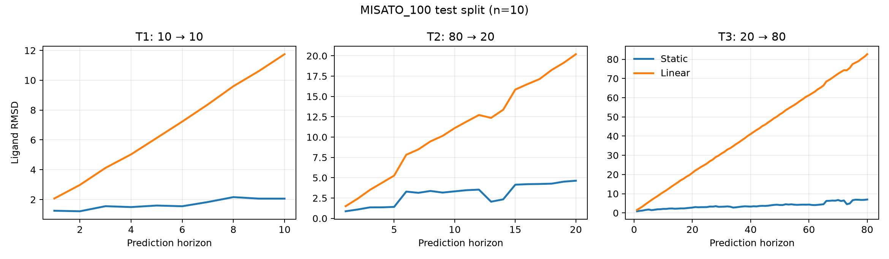

# GOAI Protein–Ligand Dynamics

GOAI「小分子–蛋白质结合轨迹预测」初赛实验。

当前目标：先在 MISATO_100 上读通真实轨迹，再依次实现 Static、Linear、Residual MLP 和多步几何约束模型。

## 数据

- 官方数据：MISATO `MD.hdf5`
- 开发子集：NeuralMD 作者提供的 `MISATO_100`
- 数据文件不上传 GitHub

`MISATO_100` 包含 80 / 10 / 10 个训练、验证和测试复合物。下载后运行：

```bash
python -m scripts.download_misato100
python -m scripts.inspect_misato --pdb-id 3SNC
```

已验证 `3SNC` 的配体重原子轨迹形状为 `(100, 39, 3)`。

运行测试集 baseline：

```bash
python -m scripts.run_baselines --split test
```

当前结果是 MISATO_100 测试子集（10 个 unseen complexes）上的自定义诊断结果，不是官方评分：

| 任务 | Static 最终 RMSD | Linear 最终 RMSD |
| --- | ---: | ---: |
| T1: 10 → 10 | 2.0601 | 11.7462 |
| T2: 80 → 20 | 4.6316 | 20.1996 |
| T3: 20 → 80 | 6.9745 | 82.6385 |



## 进度

- [x] 读取单条 ligand 轨迹
- [x] 构造 T1 / T2 / T3
- [x] Static 与 Linear baseline
- [x] RMSD–horizon 曲线
- [ ] Residual MLP
- [ ] Multi-step + geometry
