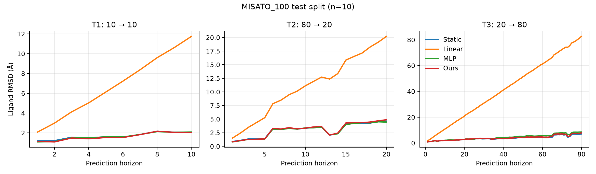
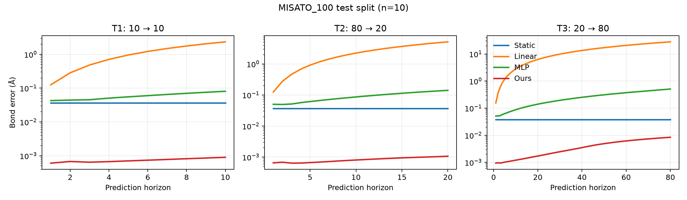

# GOAI Protein–Ligand Dynamics

GOAI「小分子–蛋白质结合轨迹预测」初赛实验。

本项目比较 Static、Linear、Residual MLP，以及多步训练与键长约束投影模型。

## 数据

- 官方数据：MISATO `MD.hdf5`
- 开发子集：NeuralMD 作者提供的 `MISATO_100`
- 数据文件不上传 GitHub

`MISATO_100` 包含 80 / 10 / 10 个训练、验证和测试复合物。下载后运行：

```bash
python -m scripts.download_misato100
python -m scripts.inspect_misato --pdb-id 3SNC
```

已验证 `3SNC` 的配体重原子轨迹形状为 `(100, 39, 3)`。

## 复现

```bash
python -m venv .venv
source .venv/bin/activate
pip install -r requirements.txt
python -m scripts.download_misato100
python -m scripts.run_baselines --split test
python -m scripts.train_one_step
python -m scripts.train_multistep --bond-weight 10
python -m scripts.run_models \
  --split test \
  --checkpoint MLP=checkpoints/one_step_mlp.pt \
  --checkpoint Ours=checkpoints/multistep_geometry.pt \
  --project Ours \
  --name final
```

## 方法

Residual MLP 根据最近两步速度预测下一步速度。Ours 从同一 MLP checkpoint 出发，增加 5 步 rollout loss、键长 loss，并对输出执行 5 次键长约束投影。键由初始构型和共价半径规则推断。

## 初步结果

以下是 MISATO_100 测试子集（10 个 unseen complexes）上的自定义诊断结果，不是官方评分。表中报告最后一个预测时刻的 ligand RMSD：

| 任务 | Static | Linear | MLP | Ours |
| --- | ---: | ---: | ---: | ---: |
| T1: 10 → 10 | 2.0601 | 11.7462 | 2.0835 | **2.0405** |
| T2: 80 → 20 | 4.6316 | 20.1996 | **4.4528** | 4.8743 |
| T3: 20 → 80 | **6.9745** | 82.6385 | 8.4936 | 7.8493 |

最后一个预测时刻的平均 bond-length error：

| 任务 | Static | Linear | MLP | Ours |
| --- | ---: | ---: | ---: | ---: |
| T1: 10 → 10 | 0.0365 | 2.3423 | 0.0807 | **0.0009** |
| T2: 80 → 20 | 0.0371 | 5.1318 | 0.1408 | **0.0011** |
| T3: 20 → 80 | 0.0383 | 27.9960 | 0.5079 | **0.0084** |





当前结果支持“显式几何约束能显著减少结构失真”，但尚不能证明该小模型全面提高长时坐标精度。T3 中 Ours 优于普通 MLP，但仍弱于 Static；后续需要加入蛋白局部环境和等变表示。

## 进度

- [x] 读取单条 ligand 轨迹
- [x] 构造 T1 / T2 / T3
- [x] Static 与 Linear baseline
- [x] RMSD–horizon 曲线
- [x] Residual MLP
- [x] Multi-step + geometry

## 来源

- [MISATO dataset](https://github.com/t7morgen/misato-dataset)
- [NeuralMD](https://github.com/chao1224/NeuralMD)
